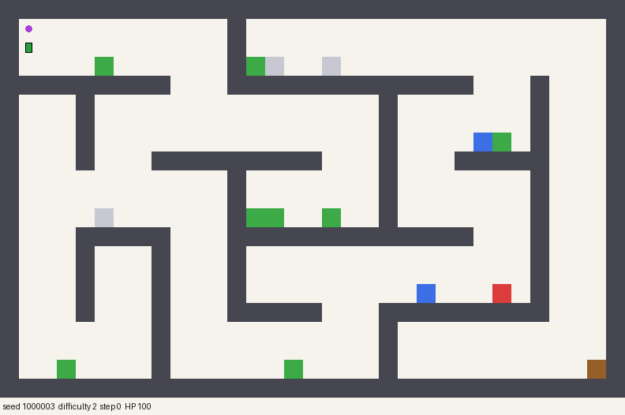

# cornichon-rl

A reinforcement-learning agent for **[Cornichon](https://github.com/Muria1/Cornichon)**, the 2D roguelike platformer
we built as a Bilkent CS102 group project. This repo is that game plus an RL agent that learns to play it: PPO
trained on the real game code (the same Java/libGDX/Box2D code as the desktop build) through a headless simulator,
on procedurally generated mazes it has never seen. See **[README_RL.md](README_RL.md)** for how it works and how to
train. The original game's README follows the agent section.

## Pretrained agents

Two trained policies ship in [`weights/`](weights/) (5.8 MB each). Each has a model card (`.json`) that says
which run it came from and how it scored. Both are playing a held-out difficulty-2 maze below, one they never saw
in training:

| `cornichon_ppo_v4`: best at reaching the door | `cornichon_fighter`: arena combat pretraining, then the game |
|---|---|
|  |  |

Benchmark: 200 held-out mazes per difficulty (seeds 1,000,000+), sampled actions. Each cell is success / death /
timeout in %, then mobs killed per level.

| difficulty | 1 | 2 | 3 | 4 | 5 | 6 |
|---|---|---|---|---|---|---|
| `cornichon_ppo_v4` | **91** / 8 / 0 · 0.8 | **82** / 17 / 0 · 1.1 | **71** / 26 / 4 · 1.1 | **42** / 51 / 7 · 1.7 | **40** / 51 / 10 · 1.7 | **16** / 76 / 8 · 1.7 |
| `cornichon_fighter` | 90 / 8 / 2 · **3.7** | 70 / 12 / 18 · **5.2** | 59 / 18 / 23 · **5.5** | 41 / 22 / 38 · **7.6** | 28 / 31 / 41 · **7.7** | 14 / 49 / 36 · **9.1** |
| random policy (100 mazes) | 0 / 80 / 20 · — | — | — | — | 0 / 85 / 15 · — | — |

`ppo_v4` mostly runs past the mobs. The fighter kills 4–7× more mobs and dies far less, but it times out more
often because it keeps fighting instead of finishing the level. Training that fixes this (a door bonus that grows
with the share of mobs killed on the way) is in progress; see [EXPERIMENTS.md](EXPERIMENTS.md).

### Run them

You need Java 17 and Python 3.10+. No GPU is needed: the policies run on CPU.

```bash
git clone https://github.com/berkegokmen1/cornichon-rl.git && cd cornichon-rl
./gradlew :headless:installDist                  # the real game code, built as a headless simulator
python -m venv .venv && . .venv/bin/activate
pip install -e .                                 # torch, gymnasium, numpy, pillow, ...
# (Ubuntu without python3-venv: `sudo apt install python3-venv`, or `uv venv .venv && uv pip install -e .`)

# win rate on 100 unseen mazes at difficulties 1-3
python -m cornichon_rl.evaluate --checkpoint weights/cornichon_fighter.pt --difficulties 1 2 3 --episodes 100 --stochastic
# GIF of it playing four unseen difficulty-2 mazes
python -m cornichon_rl.render --checkpoint weights/cornichon_fighter.pt --difficulty 2 --stochastic --out fighter.gif
# baseline
python -m cornichon_rl.evaluate --policy random --difficulties 1 2 3
```

Film it in the actual game (real sprites, camera and HUD, 60 fps mp4). This needs ffmpeg and a JDK with AWT
(`openjdk-17-jdk`, not `-headless`). On a desktop a game window opens and you can watch it play live; on a server
with no display it starts its own Xvfb (`sudo apt install xvfb`):

```bash
./gradlew :recorder:installDist
python -m cornichon_rl.record --checkpoint weights/cornichon_fighter.pt --difficulty 2 --seeds 1000000 1000001 --out-dir videos/
```

`--stochastic` (evaluate, render) samples actions the way the agent was trained and evaluated; `record` samples by default. The argmax policy (no flag) can get
stuck in loops. To train your own, see [README_RL.md](README_RL.md).

## **Cornichon**

### Bilkent University CS 102 Group Project

---

[**Table Of Contents**](#cornichon)

- [**1. What is Cornichon?**](#1-what-is-cornichon)
- [**2. Who are we?**](#2-who-are-we)
- [**3. How to execute the game?**](#3-how-to-execute-the-game)
- [**4. Dependencies**](#4-dependencies)

---

### **1. What is Cornichon?**

Cornichon is a 2D rouge-like action platformer in which the player has to control both the character and the Sphere simultaneously.
Our main goal is to create a different user
experience by implementing an algorithm to generate a unique level each time the game is played.

>

---

### **2. Who are we?**

<strong> Creators, CS102 Group 1G: </strong> <br>
Ahmet Berke Gökmen <br>
Erdem Eren Çağlar <br>
İdil Atmaca <br>
Mahmut Mert Gençtürk <br>
_(in alphabetical order)_

---

### **3. How to execute the game?**

1. You should have downloaded Java.
2. In order to play the game, you have two choice: (i) cloning the git repository or (ii) downloading the .jar file. <br>

- (i) By writing the following code on your terminal you can clone Cornichon repository:

```bash
git clone https://github.com/Muria1/Cornichon.git
cd Cornichon/
./gradlew desktop:run
```

- (ii) By just downloading the .jar file on releases page , you should be able to execute the game easily by double clicking.

If the game does not run by double clicking type the following in terminal

```
java -jar /PATH/TO/FILE/Cornichon.jar
```

---

### **4. Dependencies**

- libGDX <br>
- Box2D <br>
- MongoDB
