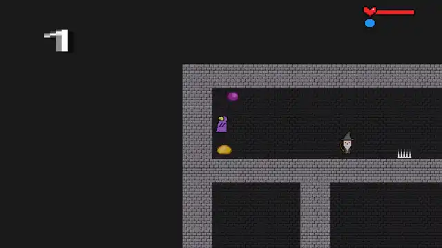
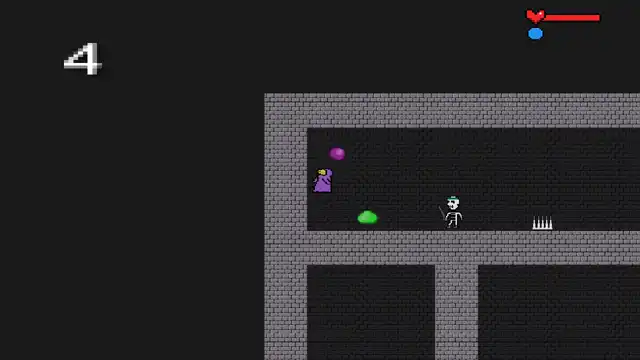
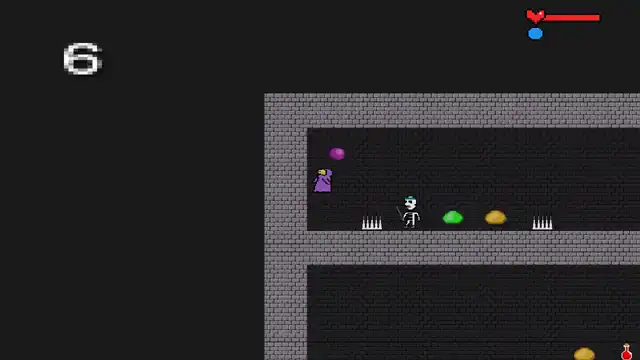
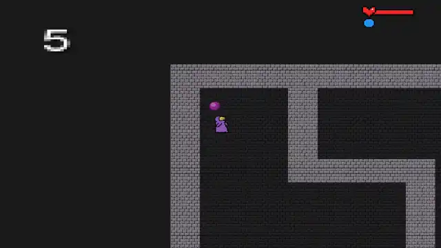

# cornichon-rl

A reinforcement-learning agent for **[Cornichon](https://github.com/Muria1/Cornichon)**, the 2D roguelike platformer
we built as a Bilkent CS102 group project. This repo is that game plus an RL agent that learns to play it: PPO
trained on the real game code (the same Java/libGDX/Box2D code as the desktop build) through a headless simulator,
on procedurally generated mazes it has never seen. See **[README_RL.md](README_RL.md)** for how it works and how to
train. The original game's README follows the agent section.

## The agent

`weights/cornichon_agent.pt` (5.8 MB) playing the actual game, on mazes it never saw in training. The clips run at
2× speed; the real-time mp4s are linked under each one.

| difficulty 1: 5 of 10 mobs killed, door at full health | difficulty 4: 14 of 22 mobs killed, then the door |
|---|---|
|  |  |
| [mp4](docs/media/agent_d1_kills.mp4) | [mp4](docs/media/agent_d4_kills.mp4) |
| **difficulty 6: 22 of 44 mobs killed, door with 40 HP left** | **a failure: difficulty 5, dies between two fireball-throwing wizards** |
|  |  |
| [mp4](docs/media/agent_d6_door.mp4) | [mp4](docs/media/agent_d5_death.mp4) |

### Results

Benchmark: 200 unseen mazes per difficulty (seeds 1,000,000 and up; training uses seeds below 100,000), actions
sampled from the policy. Each cell is **success** / death / timeout in %, then mobs killed per level.

| difficulty | 1 | 2 | 3 | 4 | 5 | 6 | 7 | 8 |
|---|---|---|---|---|---|---|---|---|
| **`cornichon_agent`** | **94** / 6 / 1 · **3.8** | **86** / 8 / 6 · **5.5** | **85** / 10 / 6 · **6.6** | **58** / 27 / 15 · **9.0** | **48** / 32 / 20 · **9.3** | **35** / 41 / 24 · **11.8** | **19** / 50 / 30 · **11.7** | **4** / 69 / 26 · **13.6** |
| `cornichon_ppo_v4` (no arena) | 91 / 8 / 0 · 0.8 | 82 / 17 / 0 · 1.1 | 71 / 26 / 4 · 1.1 | 42 / 51 / 7 · 1.7 | 40 / 51 / 10 · 1.7 | 16 / 76 / 8 · 1.7 | 9 / 83 / 8 · 1.8 | 1 / 90 / 9 · 1.7 |
| random policy (100 mazes) | 0 / 80 / 20 | | | | 0 / 85 / 15 | | | |

How it got there: [EXPERIMENTS.md](EXPERIMENTS.md) logs every run and check.

- **Two-phase training is what worked.** First an *arena* (30M steps): the door is closed and a level ends only
  when every mob is dead, so the agent has to learn the sphere. Then the normal game with the door reward on top
  (50M steps, starting from those weights). Compared with the same game training from scratch (`cornichon_ppo_v4`), it
  kills 5–8× more mobs, dies about half as often and wins more at every difficulty.
- **Rewards that only paid for the door taught it to run past mobs.** Levels from difficulty 4 up are full of mobs,
  so it died there.
- **What did not help:** a compass pointing to the nearest mob, and a door bonus that grows with the share of mobs
  killed. The compass barely moved the arena kill rate (55% of mobs vs 50% at the same point), and the game run
  started from it did worse. The bonus made it hunt longer and time out more.
- **Limits:** the game is 10 levels in a row, and the agent clears difficulty 6 a third of the time, so it does not
  beat the whole game. From difficulty 5 up, most failures are deaths, not timeouts.

`weights/cornichon_ppo_v4.pt` is the no-arena baseline. Both have a model card (`.json`) with the run, W&B id,
commit and the benchmark numbers.

### Run it

You need Java 17 and Python 3.10+. No GPU is needed: the policy runs on CPU.

```bash
git clone https://github.com/berkegokmen1/cornichon-rl.git && cd cornichon-rl
./gradlew :headless:installDist                  # the real game code, built as a headless simulator
python -m venv .venv && . .venv/bin/activate
pip install -e .                                 # torch, gymnasium, numpy, pillow, ...
# (Ubuntu without python3-venv: `sudo apt install python3-venv`, or `uv venv .venv && uv pip install -e .`)

# win rate on 100 unseen mazes at difficulties 1-3
python -m cornichon_rl.evaluate --checkpoint weights/cornichon_agent.pt --difficulties 1 2 3 --episodes 100 --stochastic
# baseline
python -m cornichon_rl.evaluate --policy random --difficulties 1 2 3
```

Watch it in the actual game (real sprites, camera and HUD, 60 fps mp4). This needs ffmpeg and a JDK with AWT
(`openjdk-17-jdk`, not `-headless`). On a desktop a game window opens and you can watch it play live; on a server
with no display it starts its own Xvfb (`sudo apt install xvfb`):

```bash
./gradlew :recorder:installDist
python -m cornichon_rl.record --checkpoint weights/cornichon_agent.pt --difficulty 4 --seeds 1000003 --out-dir videos/
scripts/make_media.sh videos/cornichon_agent_d4_seed1000003.mp4 clip   # clip.webp (2x speed) + smaller clip.mp4
```

`--stochastic` (evaluate) samples actions the way the agent was trained and evaluated, and `record` does that by
default. The argmax policy (no flag) can get stuck in loops. `python -m cornichon_rl.render` draws a top-down
debug GIF of the whole maze instead. To train your own, see [README_RL.md](README_RL.md).

## **Cornichon**

### Bilkent University CS 102 Group Project

---

[**Table Of Contents**](#cornichon)

- [**1. What is Cornichon?**](#1-what-is-cornichon)
- [**2. Who are we?**](#2-who-are-we)
- [**3. How to execute the game?**](#3-how-to-execute-the-game)
- [**4. Dependencies**](#4-dependencies)

---

### **1. What is Cornichon?**

Cornichon is a 2D rouge-like action platformer in which the player has to control both the character and the Sphere simultaneously.
Our main goal is to create a different user
experience by implementing an algorithm to generate a unique level each time the game is played.

>

---

### **2. Who are we?**

<strong> Creators, CS102 Group 1G: </strong> <br>
Ahmet Berke Gökmen <br>
Erdem Eren Çağlar <br>
İdil Atmaca <br>
Mahmut Mert Gençtürk <br>
_(in alphabetical order)_

---

### **3. How to execute the game?**

1. You should have downloaded Java.
2. In order to play the game, you have two choice: (i) cloning the git repository or (ii) downloading the .jar file. <br>

- (i) By writing the following code on your terminal you can clone Cornichon repository:

```bash
git clone https://github.com/Muria1/Cornichon.git
cd Cornichon/
./gradlew desktop:run
```

- (ii) By just downloading the .jar file on releases page , you should be able to execute the game easily by double clicking.

If the game does not run by double clicking type the following in terminal

```
java -jar /PATH/TO/FILE/Cornichon.jar
```

---

### **4. Dependencies**

- libGDX <br>
- Box2D <br>
- MongoDB
